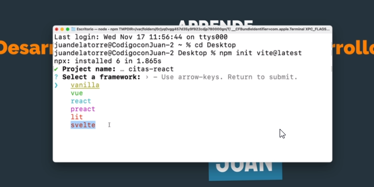
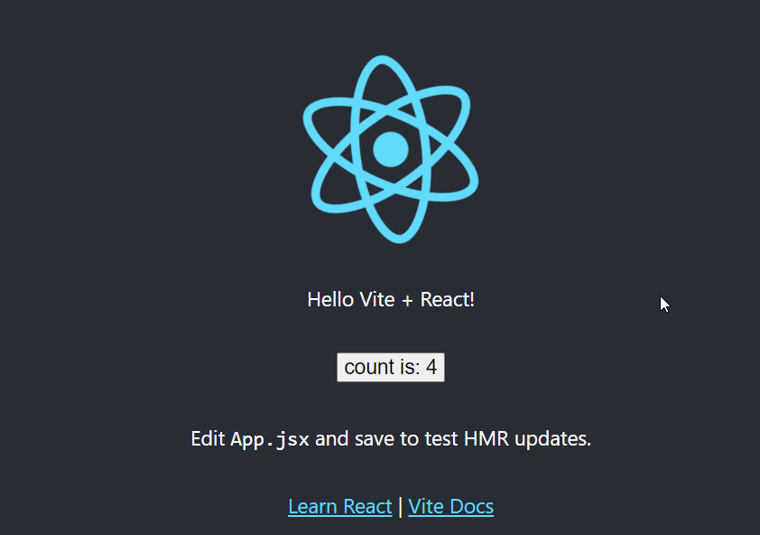
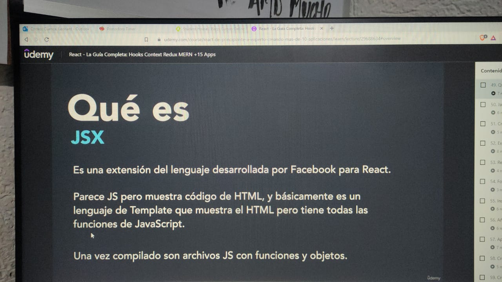
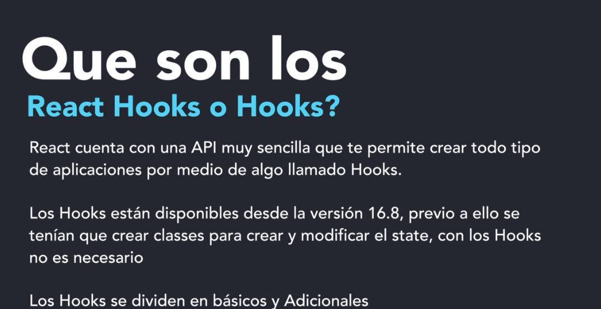
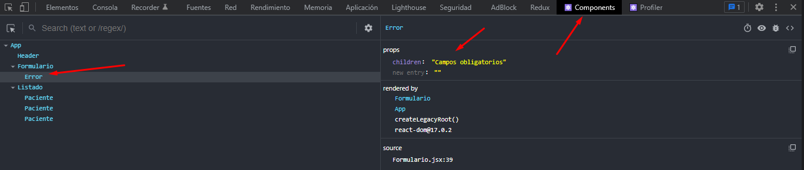

## Proyectos de Citas

Usaremos Vite para los nuevos proyectos en react. 


## Comando ejecutados 

- `npm init vite@latest` -> Ejecutamos damos (Y) -> luego colocamos nombre del proyecto -> Luego escogemos tecnología. 
- `npm run dev`
- `npm install -D tailwindcss@latest postcss@latest autoprefixer@latest` -> Para instalar tailwind 
- `npx tailwindcss init -p` -> genera los archivos configuradores 
  ```
  /*Paso 1: De configuración */
  tailwind.config.js
  
module.exports = {
  purge: ["index.html", "./src/**/*.jsx"],
  
  theme: {
      extend: {},
  },
  variants: {
      extend: {},
  },
  plugins: [],
};


*Paso 2: Buscamos citas-react\src\index.css*
```
Debemos importar tailwind 
@import "tailwindcss/base"
@import "tailwindcss/components"
@import "tailwindcss/utilities"
```
## Notas: 
Luego de ejecutar el comando podemos escoger que tecnología
- Para este caso vamos a escoger react. 
- Vite es soportado por Version de  node 12
- import React from 'react' -> En nuevas actualizaciones no es necesario importarlo en todos los archivos solo debe ir en main.jsx 
- import ReactDOM from 'react-dom' -> Pues refrescando que es el encargado de la parte web su contra parte react-native 
- Siempre se va ir trabajando en App.jsx 
### Para el uso de vite nos das opción de establecer que tecnologia usar 





### Conceptos 

Que es jsx -> Es un lenguaje de template que muestra html pero tiene las funciones de JS. 




> Reglas Jsx 
- Se debe incluir el cierre de las etiquetas. 
- Como estamos  usando vite -> cada archivo debe tener extensión jsx si hubiera sido un proyecto con esencia react podemos usar extensiones .js 
- Cada componente debe tener un return : Esto quiere decir que los elementos html deben estar metidos en una caja bien sea un div o span setion etc. ejemplo

```
  return (
    <div className="App"> -> Nivel Alto 
      <h1>Hola mundo</h1> - Nivel Bajo 
      <p>Hola mundo 1</p>
      <p>Hola mundo2</p>
    </div>
  )

  Otro ejemplo 
  return (
    <div className="App"> -> Nivel Alto 
        <div> - Nivel Bajo 
            <h1>Hola mundo</h1> - Nivel Bajo 
            <p>Hola mundo 1</p>
            <p>Hola mundo2</p>
        
        </div>
        <div> - Nivel Bajo 
            <h1>Hola mundo</h1> - Nivel Bajo 
            <p>Hola mundo 1</p>
            <p>Hola mundo2</p>
        
        </div>
    </div>
  )


Ejemplo Para evitar tantos div es un fragment 
<>

    <div className="App"> -> Nivel Alto 
        <div> - Nivel Bajo 
            <h1>Hola mundo</h1> - Nivel Bajo 
            <p>Hola mundo 1</p>
            <p>Hola mundo2</p>
        
        </div>
        <div> - Nivel Bajo 
            <h1>Hola mundo</h1> - Nivel Bajo 
            <p>Hola mundo 1</p>
            <p>Hola mundo2</p>
        
        </div>
    </div>

</>

```
- el ciere debe ser </>
- Lo que esta dentro del return es lo que se va ver en pantalla 

## Exntesiones que se recomienda 
-ES7 -  https://github.com/dsznajder/vscode-react-javascript-snippets/blob/HEAD/docs/Snippets.md
  - rfcp  -> genera extructura con prototype
  - rfce -> Generar estrcutura 
  - rafce -> funcion flecha 


## Hooks 

Hooks : De manera simple son funciones que ayudena tu proyecto a ser manejados por estados.


Hooks Basicos
- useState
- useEffect 
- useContext

Hooks Complejos 
- useReducer
- useCallback
- useMemo
- useRef
- useLayoutEffct
- useDabugValue
- useImperativeHandle

**Tambien puedes Crear tus propios Hooks **


## State

> Es una variable con información relevante 
- Podemos usar los state con un componenente
- Podemos generar un state para pasarlo a diferete componentes 

```
import {useSate} from 'React';

const [cliente, setCliente] = useState({});

```
**PD: **
- cliente      -> es tu variable
- setCliente   -> es el modificador y solo modifica esta variable
- useState({}) -> Permite inicializar el state, permite almacenar array, objetos, integer, string, boolean
- Permite reaccionar cada ves que se recarga tu ambiente este reacciona
- Siempre edita por el modificador  
- React reaccion al cambio del state sin necesidad de recargar la pagina 
- Si puedes cambiar el valor directamente cliente='Leonard' -> Pero es mala practica

## Reglas de los Hooks 
- Los Hooks se deben colocar en la parte superior  del return -> 
- No lo coloques fuera de la función
- No se debe poner despues de un return 
- No lo pongas en condincionales ->  siempre usa condición ternaria  ejemplo: { Variable ? 'mensaje 1':'mensaje 2' }  o  {valor && 'mensaje '}
- Debes declarar los hooks en la parte superior 
- Que son los props ->  es una forma de pasar valores o mejor dicho propiedades entre componentes, los props se pasan de padre a hijo nunca de hijo a padre, puedes pasar una funcion tambien Ejemplo:
```
<Error 
  children={'Campos obligatorios'}
  datosuno={'Campos obligatorios'}
  datostres={'Campos obligatorios'}
  datoscuatro={'Campos obligatorios'}
  fn={nombeFuncion}
  nombeFuncion={nombeFuncion}
/>
```


- Children es una palabra reservada en react hace referencia a todo lo que le pases a un componente, toma todos los valores que le pases a un componente