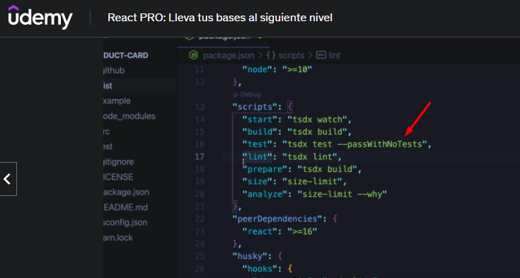

# React PRO: Lleva tus bases al siguiente nivel
- *Profesor: Fernando Herrera*
- *Inicio: 06/01/2023*
- *Fin: *

## Sección 1: Introducción 
## Clase número 1-5:  Instalaciones recomendadas - Curso de React Pro

**Notas Comandos Github**
- `git push -u origin main` -> Permite que aqui sea el push por defecto 
- `git branch -M nuevoNombre` -> Cambia el nombre del repo raiz 

**Instalaciones Necesarias**
- Visual Studio Code
- Postman
- Mongo Compass
- Git
``` 
git config --global user.name "Tu nombre"
git config --global user.email "Tu correo"
```
- Node
- Google Chrome
**Extensiones de VSCode**
- Activitus Bar
- Configuración del Bracket Pair Colorizer 2
- Bracket Pair Colorizer 2
``` 
"bracket-pair-colorizer-2.colors": [
    "#fafafa",
    "#9F51B6",
    "#F7C244",
    "#F07850",
    "#9CDD29",
    "#0098FA"
],
``` 
**Tema que estoy usando en VSCode:**
- Tokyo Night
- Iconos
- Instalaciones adicionales
- ES7 React/Redux
- Simple React Snippets
- Auto Close Tag
- TypeScript importer
- CSS Modules
- MDX

## Sección 2: Reforzamiento sobre React 
## Clase número 6-10: Inicio de proyecto - Bases de react 

**Comandos para instalar proyecto en react**

- `npm install -g npm@9.2.0` -> Previamente se debe instalar
- `npx create-react-app@latest bases --template typescript` -> Iniciamos un proyecto especificando typescript 
> Nota: Usamos @latest ya que tenemos una version anterior de react instalada 
- Ejecutamos desde la base del proyecto `nom run start`
**Procedemos a limpiar**
> Podemos eliminar los siguientes archivos. 
- App.css
- App.text.tsx
> Podemos dejar el archivo principal limpio 
```
//App.tsx -> Es el archivo raiz 

function App() {
  return (
  <>
    <h1>React</h1>
    <hr/>
  </>
  );
}

export default App;

```
 

**Recuerda**
- La extensiones tipo `ts` son archivos typescript
- La extensiones tipo `tsx` son archivos que tienen componenetes react 


## Clase 11: Forma de trabajar PropTypes 

>Podemos iniciar, cambiar nombre o extender Props 
- Podemos crear las interfaz con los Props que deseamos 

```
import { useState } from "react";


//Una manera de definir, cambiar nombre o extender Props 
interface Props{
  initialValue?:number
}

export const Counter = ({initialValue = 0}:Props) => {

const [counter, setCounter] = useState(initialValue);

  const handleClick = ()=>{
    setCounter(prev=> prev + 1); 
    console.log(counter);
  }

  return (
    <>
    
    <h1>Counter: {counter}</h1>

    <button onClick={handleClick}>
        +1
    </button>
    
    </>
  )
}
```
## Clase 13: Optimizaciones y tipado 
> Una manera corta de destructurar dentro del estado 

```
    const [{ counter, clicks }, setCounterState] = useState<CounterState>({
      counter:initialValue,
      clicks:0,
    });
  
```

## Clase 15: Animaciones  con npm install gsap
> GSAP es un paquete de animaciones en js, solo debemos instalar e omplementar

- Paso 1: `npm install gsap`
- Paso 2: Incoporamos en nuestro componenete `import {gsap} from 'gsap'; `
- Paso 3: Leer manual ->`https://www.npmjs.com/package/gsap` 
- Paso 4: Leer manual ->`https://greensock.com/docs/v3/GSAP` 
- PAso 5: 
```
//Animación Básica
// Usando  Selector y forma directa
gsap.to('h2', { y:-10, duration:0.2, ease:'ease.out' }).then(()=>{
  gsap.to('h2', { y:0, duration:1, ease:'bounce.out' })
});


//Usando la forma correcta 
  useEffect(()=>{
    if (counter<10)return; 
    console.log('%c muestra console con color', 'color:red; background-color:black;');

      //Animación Básica
      //Controlador de video
      const timeline = gsap.timeline(); 
      timeline.to(counterElement.current, { y:-10, duration:0.2, ease:'ease.out' });
      timeline.to(counterElement.current, { y:0, duration:1, ease:'bounce.out' });

    },[counter])


```

## Clase 16: useRef y TimeLines
> Debes recordar como usar el useRef
- Paso 1: importamos en la cabecera -> `import {  useRef } from "react";`
- Paso 2: Declaramos `  const counterElement = useRef<HTMLHeadingElement>(null);`
- Paso 3: lo aplicamos donde queremos usar la referencia -> 
```
<h2 id="total" ref={counterElement}>{counter}</h2> 
``` 
- Paso 4: lo implementamos usando `current`
```
 timeline.to(counterElement.current, { y:0, duration:1, ease:'bounce.out' });
```

## Clase 17:  CustomHooks con referencias HTML

> Elevamos y mejoramos la programación usando un hooks 

```
 //Componente 
import {useCounter} from '../Hook/useCounter';


//Una manera de definir, cambiar nombre o extender Props 
interface Props{
  initialValue?:number
}

export const CounterHook = ({initialValue = 0}:Props) => {

  const {counter, counterElement, handleClick} = useCounter();
  
  return (
    <>
    
    <h1>Counter Hook</h1>
    <h2 id="total" ref={counterElement}>{counter}</h2>

    <button onClick={handleClick}>
        +1
    </button>
    
    </>
  )
}

```

```
//creamos nuestro hook
import { useState, useEffect, useRef } from "react";
import {gsap} from 'gsap'; 
const MAXIMUN_COUNT = 10;

export const useCounter = ()=>{

    const [counter, setCounter] = useState(5);
    const counterElement = useRef<HTMLHeadingElement>(null);
  
    const handleClick = ()=>{
      
        setCounter(prev=> Math.min(prev + 1, MAXIMUN_COUNT) ); 
        console.log(counter);
        console.log('%c muestra console con color', 'color:red; background-color:black;');
    }
  
    useEffect(()=>{
      if (counter<10)return; 
      console.log('%c muestra console con color', 'color:red; background-color:black;');
  
        //Animación Básica
        //Controlador de video
        const timeline = gsap.timeline(); 
        timeline.to(counterElement.current, { y:-10, duration:0.2, ease:'ease.out' });
        timeline.to(counterElement.current, { y:0, duration:1, ease:'bounce.out' });
  
      },[counter])

      
    //Lo trabajamos tipo objeto para organizar
    return {
        counter,
        counterElement,
        handleClick


    }
}
```

## Clase 18: Recomendaciones para los Hooks 

```
import { useState, useEffect, useRef, useLayoutEffect } from "react";
import {gsap} from 'gsap'; 
const MAXIMUN_COUNT = 10;

export const useCounter = ({maxCunter = 10})=>{

    const [counter, setCounter] = useState(5);
    const alementToAnime = useRef<HTMLHeadingElement>(null);
    const tl = useRef(gsap.timeline());
  
    const handleClick = ()=>{
      
        setCounter(prev=> Math.min(prev + 1, MAXIMUN_COUNT) ); 
        console.log(counter);
        console.log('%c muestra console con color', 'color:red; background-color:black;');
    }
  

    useLayoutEffect(()=>{

      if(!alementToAnime.current)return; 
        //Animación Básica
        //Controlador de video
        tl.current.to(alementToAnime.current, { y:-10, duration:0.2, ease:'ease.out' });
        tl.current.to(alementToAnime.current, { y:0, duration:1, ease:'bounce.out' }).pause();
    },[])


    useEffect(()=>{
      tl.current.play(0);
    },[counter])

      
    //Lo trabajamos tipo objeto para organizar
    return {
        counter,
        alementToAnime,
        handleClick


    }
}
```

## Clase 19-25: Action  Creater 

**Notas**
- Si nos preguntan que patron de diseño usamos en react podemos responder `Redux` ya que podemos definir las acciones. 
- Segmentación por estados y acciones 
- 


## Sección 3: Opcional - Construcción del proyecto inicial 

## Clase 27: Inicio de proyecto 

**Recordatorios**
Pasos para crear un proyectos: 
- Paso 1: `npx create-react-app nombreApp --template typescript`
- Paso 2: `npm start`


## Clase 28: Configurar rutas tradicionales - React router V6

> Validar ya que la version Router V6 y V5 ambas trabajan de manera diferente 

**Enlace**
- https://reactrouter.com/en/main


**Instalación**
- Paso 1: Ejecutar el comando `npm install -D react-router-dom@6`
- Paso 2: podemos crear un componente usamos el comando `rafc` y esto genera un esqueleto para crear el componente


```
 import { BrowserRouter, Routes, Route, NavLink, Navigate  } from 'react-router-dom';

 import logo from '../../logo.svg';

export const Navigations = () => {
  return (
    <BrowserRouter>
        <div className='main-layout'>
            <nav>
                
                <ul>
                    <li><NavLink to="/home"  className={({isActive})=>isActive ? 'nav-active':''}>Home</NavLink></li>
                    <li><NavLink to="/about" className={({isActive})=>isActive ? 'nav-active':''}>About</NavLink></li>
                    <li><NavLink to="/users" className={({isActive})=>isActive ? 'nav-active':''}>User</NavLink></li>
                </ul>
            </nav>
            <Routes>
                <Route path='/home' element={<h1>Home Page</h1>}></Route>
                <Route path='about' element={<h1>About Page</h1>}></Route>
                <Route path='users' element={<h1>User Page</h1>}></Route>
                
                <Route path='/*' element={<Navigate to="/home" replace />}></Route>
            </Routes>

        </div>    
    </BrowserRouter>
  )
}

``` 


**Notas**
- Diferencia etre el Link y NavLink 
- El `Link` es usado como una ancla 
- El `NavLink` puede determinar si esta en una ruta y colocar con un estilo si esta activo o no, o si fue consultado o no el link
 
## Sección 4: LazyLoad - Chunks - React Roter DOM V5 

## Clases:32-33-64-35-36 
**LazyLoad**
- Nos Permite cargar modulos bajo demanda. 
- Podemos decidir si cargar toda la aplicación esto con el proposito si la app es muy pesada nos facilita esta decisión.  
- LazyLoad  no es una aplicación magica, no es muy recomendable usarlo de manera descarada.
- Es util en aplicaciones mobiles para solucionar ciertos problemas. 
- La logica es que el LazyLoad llama un chunks cada vez que lo requiere. 
- Se recomienda cargar todo por modulo no por componentes 

```
En esta sección vamos a llevar nuestro sistema de rutas a otro nivel, el objetivo principal sera:

Aplicar Lazy Load en cada Componente

Aplicar Lazy Load por módulo

La idea del módulo es que nos permita cargarlo y todas sus dependencias en conjunto.
```

## Clase:38 

> en esta sección se define una mejoria en cuanto a crear componentes dinamicos 

```
import {LazyPageone, LazyPagetwo, LazyPagetree} from '../../lazyload/pages';


/* Parecido a una Clase pero no es*/
//Creamos un tipo 
interface Route {
    to:string;
    path:string;
    Component:() => JSX.Element;//Asi nombramos a los componentes
    name:string;

}

export const routes: Route[] = [
    {
        to:   '/lazy-1',
        path: 'lazy-1',
        Component: LazyPageone,
        name:'Lazy-1'
    },{
        to:   '/lazy-2',
        path: 'lazy-2',
        Component: LazyPagetwo,
        name:'Lazy-2'
    },{
        to:   '/lazy-3',
        path: 'lazy-3',
        Component: LazyPagetree,
        name:'Lazy-3'
    }, 

]

///System Volume Information
import { BrowserRouter, Routes, Route, NavLink, Navigate  } from 'react-router-dom';
import logo from '../../logo.svg';

//Import to  components 
import {LazyPageone, LazyPagetwo, LazyPagetree} from '../../lazyload/pages';

import { routes } from './routes'; //Forma de crear link dinamicos 

export const Navigations = () => {
  return (
    <BrowserRouter>
        <div className='main-layout'>
            <nav>
                
                <ul>
                <li><NavLink to="/home"  className={({isActive})=>isActive ? 'nav-active':''}>Home</NavLink></li>       
                    {/*TODO: Crear  naclink dinamicos  */
                        routes.map(route =>( 

                            <li key={route.to}><NavLink to={route.to}  className={({isActive})=>isActive ? 'nav-active':''}>{route.name}</NavLink></li>
                            
                        ))
                    }
                </ul>
            </nav>
            <Routes>
                <Route path='/home'    element={<h1>Home Page</h1>}></Route>
                <Route path='lazyone'  element={ <LazyPageone/> }></Route>
                {
                    routes.map(route =>( 
                        <Route key={route.to} path={route.path} element={<route.Component/>}></Route>
                    ))
                }
                <Route path='/*' element={<Navigate to="/home" replace />}></Route>
            </Routes>

        </div>    
    </BrowserRouter>
  )
}


``` 

## Clase:39. LazyLoad y Suspense

**Forma de generar Lazy**
- Paso 1: Para definir un `lazy` debemos importarlo `import {lazy} from 'react';`
- Paso 2: Para incoporarlo debemos definilos: 
```
const Lazy1 = lazy(()=>import(/* webpackChunkName: "LazyPage1"*/'../../lazyload/pages/LazyPageone'));
const Lazy2 = lazy(()=>import(/* webpackChunkName: "LazyPage2"*/'../../lazyload/pages/LazyPagetwo'));
const Lazy3 = lazy(()=>import(/* webpackChunkName: "LazyPage3"*/'../../lazyload/pages/LazyPagetree'));
``` 
- Paso 3: Los `lazy` para usarlos debemos definir los export default 
```
import React from 'react'

export const LazyPageone = () => {
  return (
    <h1>LazyPageone</h1>
  )
}

export default LazyPageone; //<--- Se refiere a esto 
```
- Paso 4: Debemos definir la firma 
```
type JSXComponent = () => JSX.Element; 

/* Parecido a una Clase pero no es*/
//Creamos un tipo 
interface Route {
    to:string;
    path:string;
    Component: Component:React.LazyExoticComponent<JSXComponent> | JSXComponent;//Asi nombramos a los componentes cuando usamos Lazy recuerda si muestra error debes importar -> import React from 'react'; al principio del archivo donde lo estes implementando 
    name:string;

}
```

**Nota**
- Recuerda que para que funcione el Lazy debes nombrarla `01-lazyload` aun estamos pollos pero recomiendo por el momento manejarlo así. 

- Paso 5: Debemos crear un suspence 
**Notas**
- Se recomienda usar typescript 
- Suspence es un componente que usamos para embolver todo un elemento -> Suspense le indica a react que si estoy cargando un modulo debemos esperar para cargar pero mientras lo estoy cargando haz lo siguiente. 

  - Paso 5.1: debemos importar el suspence -> `import {Suspense} from 'react';` en el archivo donde se usará para este caso en esl navigator.tsx 
  - Paso 5.2: Luego suspence es un tipo de componente va envolver lo que deseas que espere, quedará asi referencia -> [ejemplo Real](./Proyectos/react-app/src/routes/Navigation.tsx)
```
//Ojo dentro del <Router> esta la estructura, solo lo coloco así para que se pueda entender el bloque y no quede tan extenso el código 
export const Navigation = () => {
  return (
    <Suspense fallback={<span>Cargando... </span>}>
      <Router>
        .....
      </Router>
    </Suspense>
  );
}
```


## Clase 40-45: 

**Notas**
- Forma de generar ruta con `react Routes v-6`
- 

```
import { NavLink, Route, Routes, Navigate } from "react-router-dom";
import {LazyPageone, LazyPagetwo, LazyPagetree} from '../../lazyload/pages';


export const LazyLayout = ()=>{

    return (

        <div>
            <h1>LazyLayout</h1>
            <ul>
                <li><NavLink to="lazy1">Lazy 1</NavLink></li>
                <li><NavLink to="lazy2">Lazy 2</NavLink></li>    
                <li><NavLink to="lazy3">Lazy 3</NavLink></li>
            </ul>

            <Routes>
                <Route path="lazy1" element={<LazyPageone/>}></Route>
                <Route path="lazy2" element={<LazyPagetwo/>}></Route>
                <Route path="lazy3" element={<LazyPagetree/>}></Route>
                <Route path="*" element={<Navigate replace to="lazy1"/>}></Route>
            </Routes>
        </div>
    )
}

export default LazyLayout;
```

## Clase 46: Forma de mejorar la importación 

- Paso 1: Debemos crar un index en la carpeta que tenemos nuestros componenetes 
- Paso 2: vamos creando el export en ese index 
```
export { LazyPage1 } from './LazyPage1';
export { LazyPage2 } from './LazyPage2';
export { LazyPage3 } from './LazyPage3';

```
- Paso 3: lo incoporamos donde deseamos 
`import { LazyPage1,LazyPage2,LazyPage3 } from '../01-lazyload/pages/index';`

## Clase 47-48-49-50: Forma de mejorar la importación 

**Comando**
- Forma de crear un estilo `rafc`

**Forma de generar un routes eficiente**
```
        <Switch>

            {/*TODO: Crear  naclink dinamicos  */
              routes.map(({path, Component}) =>( 
                <Route 
                    key={path} 
                    path={path} 
                    render={()=>{return <Component/>}}/>
                
            ))
            }
            <Redirect to={routes[0].path}/>                      
        </Switch>
```

## Clase 51-52-53-54: Nested Lazy Routes

- Podemos generar lazy por modulo para este ejemplo me fusilo el del profesor para no afectar mi desarrollo que sta 100% funcoonal 
- Lo colocare como referencia en `react-adv-lazyload-nested` -> [Ejemplo Modular](../ReactAvanzado/Proyectos/react-adv-lazyload-nested/)
- Codigo fuente completo sin compilar OJO. 


## Sección 5: Sección 5: Patrones de componentes - Compound Component Pattern 
## Clase 55-56: 

**Nota**
- Los patrones de diseño es la forma o un molde que podemos seguir para lograr crear software
- **Conozco** -> MVC 
- **Conozco** -> Redux (Estado) 
- **Conozco** -> Abstract Factory -> es un diseño que proporciona una forma de crear familias de objetos relacionados sin imponer sus clases concretas, encapsulando un grupo de fábricas individuales que tienen un tema común sin especificar sus clases concretas. usado en JAVA para microservicios
- **Conozco** -> Arquictectura Limpia -> Dominio, Aplicación, Presentación -> El proposito de este patron es que las dependencias, se organicen de forma que las capas centrales no sepan nada de las capas externas. Ejemplo las cebollas tienen tantas capas que las internas no saben de las capas externas 
- **Conozco** -> Un componente de orden superior (HOC) es un patrón de diseño en React que le permite reutilizar y compartir lógica entre componentes. Los HOC no son parte de la API de React, sino un patrón que surge de la naturaleza compositiva de React. -> Higher Order Component (HOC)

> Patrones de Componentes -> Son patrones que nos daran beneficios para crear nuestros compoenentes 
- **Estudiando** -> Compound Component Pattern -> Nos ayuda armar un componente y dentro de ese componente, añadir otros componenentes y tener un control al crearlos, IONIC 

## Clase 57-58-59: 

**Recordar usar Hooks**
```
//Creamos 
import { useState } from "react";

export const useProduct = ()=>{

    const [counter, setCounter] =useState(0);
   
    const increaseBy =(value:number)=>{
        setCounter(prev => Math.max(prev+value, 0)); //Forma de sumar pero en una sola linea 
    }
    
    return {
        counter, 
        increaseBy
    }
}

//Implementamos donde queramos 
export const ProductCard = () => {

    //Declaro variables 
    const {counter, increaseBy} =useProduct();
```

- Referencia [Ejemplo](../ReactAvanzado/Proyectos/react-adv-compound/src/02-component-patterns/components/ProductCard.tsx)

## Clase 60: Forma tradicional Vs Compound Component Pattern (Patrón de componentes compuestos)


> El patrón de "Compound Component" es una técnica utilizada en React para construir componentes complejos que se componen de varios subcomponentes. En este patrón, el componente principal es responsable de coordinar y controlar el comportamiento de los subcomponentes.

**Ventajas**
- Permite crear componentes de manera dinámica 
- La idea detrás de este patrón es proporcionar una interfaz limpia y clara para los desarrolladores que utilizan el componente
- Cada subcomponente en el grupo tiene su propio conjunto de props y estado, pero juntos, funcionan como un solo componente.


**Desventajas**
- No permite heredar estilos ya que se definen pero no llegan 
- Por ser dinamico cuesta un poco implementar los estilos 

**Ejemplo**
> Un ejemplo común de un componente de "Compound Component" es un componente de pestañas. Este componente consiste en un componente principal de pestañas y varios subcomponentes de paneles que muestran el contenido correspondiente a cada pestaña. En este caso, el componente de pestañas es responsable de coordinar el comportamiento de los subcomponentes de paneles.

```
// componente principal de pestañas
class Tabs extends React.Component {
  constructor(props) {
    super(props);
    this.state = {
      activeTabIndex: 0
    };
  }

  handleTabClick(tabIndex) {
    this.setState({ activeTabIndex: tabIndex });
  }

  render() {
    const children = React.Children.map(this.props.children, (child, index) => {
      if (child.type.displayName === "TabPanel") {
        return React.cloneElement(child, {
          active: this.state.activeTabIndex === index
        });
      }
      return child;
    });

    return <div>{children}</div>;
  }
}

// componente de pestaña individual
class Tab extends React.Component {
  render() {
    return (
      <button onClick={this.props.onClick}>
        {this.props.children}
      </button>
    );
  }
}

// componente de panel de pestaña individual
class TabPanel extends React.Component {
  render() {
    return (
      <div style={{ display: this.props.active ? "block" : "none" }}>
        {this.props.children}
      </div>
    );
  }
}

TabPanel.displayName = "TabPanel";

// uso del componente Tabs
function App() {
  return (
    <Tabs>
      <Tab onClick={() => console.log("tab1 clicked")}>Tab 1</Tab>
      <Tab onClick={() => console.log("tab2 clicked")}>Tab 2</Tab>
      <Tab onClick={() => console.log("tab3 clicked")}>Tab 3</Tab>
      <TabPanel>Panel 1</TabPanel>
      <TabPanel>Panel 2</TabPanel>
      <TabPanel>Panel 3</TabPanel>
    </Tabs>
  );
}
```


**Forma Tradicional**
```
//forma Tradicional 

import React from 'react'
import { ProductCard } from '../components/ProductCard'

//Definimos solo un objeto de varios productos 
const product = {
    id:'1',
    title:'Coffee Mug- Card',
    img:"./coffee-mug.png"
}

export const ShoppingPage = () => {
  return (
        <>
            <div>
                <h1>Shopping Store</h1>
            </div>
            <div style={{
                display: 'flex',
                flexDirection: 'row',
                flexWrap: 'wrap'
            }}>        
            <ProductCard product={product}/>

            </div>    
        </>
  )
}

```

**Patron componente compuesto -> Compound Component Pattern**  
```
//Paso 1: 

//Importo librerias 
import styles from '../styles/styles.module.css';
import notImage from "../assets/no-image.jpg";
import  {useProduct}  from '../hooks/useProduct';

//Creamos nuestras props 
interface Props { //Esta interfaz es de mayor gerarquia 
  product:Product
}

//Creamos un ainterfaz para definir el objeto 
interface Product {
  id:string,
  title:string,
  img?:string//Hace que sea opcional
}

export const ProductImage =({img = ''})=>{
  return ()
}

export const ProductTitle =({title}:{title:string})=>{//Solos e hace esto cuando es solo una propiedad si no pues debemos aplicar lo de una interfaz
  return (<span className={styles.productDescription}>title</span>)
}

interface ProductButtonsProps {
  increaseBy:(value:number)=>void; //forma de declarar un metodo 
  counter:number;
}

export const ProductBottons =({increaseBy,counter}:ProductButtonsProps)=>{
  return (        
  <div className={styles.buttonsContainer}>
    <button className={styles.buttonMinus} onClick={()=>increaseBy(-1)}>-</button>
    <div className={styles.countLabel}>{counter}</div>
    <button className={styles.buttonAdd} onClick={()=>increaseBy(+1)}>+</button>
</div>)
}


export const ProductCard = ({product }:Props) => {

    //Declaro variables 
    const {counter, increaseBy} =useProduct();

  return (
    <div className={styles.productCard}>
        
        <ProductImage img={product.img}/>

        <ProductTitle title={product.title}/>
        
        <ProductBottons 
          increaseBy={increaseBy} 
          counter={counter} 
          />

    </div>
  )
}

//Paso 2

//Importo librerias 
import styles from '../styles/styles.module.css';
import notImage from "../assets/no-image.jpg";
import  {useProduct}  from '../hooks/useProduct';
import { ReactElement, createContext, useContext} from 'react';

//Creamos nuestras props 
interface Props { //Esta interfaz es de mayor gerarquia 
  product:Product;
  //children?:()=>JSX.Element //El ? hace que sea opcional , forma de pasar los hijos 
  children?: ReactElement | ReactElement[] 
}

//Creamos un ainterfaz para definir el objeto 
interface Product {
  id:string,
  title:string,
  img?:string//Hace que sea opcional
}

//Definimos nuestro contexto 

interface PructContextProps {
  counter:number;
  increaseBy:(value:number)=>void; //forma de declarar un metodo 
  product:Product
}
const ProductContext = createContext({} as PructContextProps);
const {Provider} =  ProductContext; 


export const ProductImage =({img = ''})=>{
  
  const {product} = useContext(ProductContext)
  let imgToShow:string;
  if (img){
    imgToShow=img
  }else if(product.img){
    imgToShow=product.img
  }else{
    imgToShow = notImage
  }
  return ()
}

export const ProductTitle =({title}:{title?:string})=>{//Solos e hace esto cuando es solo una propiedad si no pues debemos aplicar lo de una interfaz
  
  const {product} = useContext(ProductContext)
  let titleToShow:string;
  if (title){
    titleToShow=title
  }else if(product.title){
    titleToShow=product.title
  }else{
    titleToShow = 'sin titulo'
  }  
  
  return (<span className={styles.productDescription}>{titleToShow}</span>)
}

export const ProductBottons =()=>{
  
  const {increaseBy,counter} = useContext(ProductContext);
  
    return (        
  <div className={styles.buttonsContainer}>
    <button className={styles.buttonMinus} onClick={()=>increaseBy(-1)}>-</button>
    <div className={styles.countLabel}>{counter}</div>
    <button className={styles.buttonAdd} onClick={()=>increaseBy(+1)}>+</button>
</div>)
}


export const ProductCard = ({children, product }:Props) => {

    //Declaro variables 
    const {counter, increaseBy} = useProduct();

  return (
    <Provider value={{
      counter,
      increaseBy,
      product
    }}>
      <div className={styles.productCard}>
          {children}
      </div>
    </Provider>    
  )
}


import React from 'react'
import { ProductCard, ProductImage, ProductTitle, ProductBottons } from '../components/ProductCard'

//Definimos solo un objeto de varios productos 
const product = {
    id:'1',
    title:'Coffee Mug- Card',
    img:"./coffee-mug.png"
}

export const ShoppingPage = () => {
  return (
        <>
            <div>
                <h1>Shopping Store</h1>
            </div>
            <div style={{
                display: 'flex',
                flexDirection: 'row',
                flexWrap: 'wrap'
            }}>        
            <ProductCard product={product}>
                <ProductImage/>
                <ProductTitle/>
                <ProductBottons/>
            </ProductCard>


            </div>    
        </>
  )
}
```

# Sección 6: Patrones de componentes - Extensible Styles
> En esta sección aprenderemos a extender la funcionalidad de nuestro componente añadiendo la posibilidad de interpretar clases de CSS y/o estilos en línea (inline styles)

## Clase 70: Extensible Styles

> Este patron de diseño permite enviarle o heredarle estilo de clases a sus componentes pre fabricados.  

**Pasos**
- Paso 1: Debemos definir nuestros estilos, nuestra carérta styles-> `custom-styles.css`
- Paso 2: Recuerda que este metodo se enviar por props, ciertos paramentros lo que se recomienda es ajustar las interface o crear interface por cada componente creado Ej
```
  //Definimos interfaz para el componente titulo 
  export interface PructCardTitle {
    className?:string;
    title?:string;
  }  
  
//Definimos interfaz para el componente image 
  export interface PructCardImage {
    className?:string;
    img?:string;
  }
  
  //Definimos interfaz para el componente image 
  export interface PructCardButtons {
    className?:string;
  }
```
- Paso 3: Recuerda que existe una interface pricipal que permite heredar a los hijos `children` solo aqui en esa interface donde va el children debemos decirle que permita recibir `className` Ejem
```
//Creamos nuestras props Esto es la clave para que funcione el patron de diseño 
export interface ProductCardProps { //Esta interfaz es de mayor gerarquia 
    product:    Product;
    children?:  ReactElement | ReactElement[];
    className?: string;//>Aqui la clave del exito
  }

```
- Paso 4: Luego de generar las interfaces vamos al props de cada componente y mathing con las interfaces adecuadas eso permite recibir `className` y podelos usarlas en nuestro componente Ej
```
//Importamos interfaces
import {PructCardImage} from '../interfaces/interfaces';

export const ProductImage =({img, className}:PructCardImage)=>{
```
 > debe ver que aqui importamos la interfacess y mathing para que quede con la definición 
- Paso 5: ya que recibimos `className` podremos usarlo en donde deseamos aqui un gran detalle debemos usar bath tips `${}` para poder usarlo en el verdadero `className` Ejemplo 
```
return ()
```
Guia -> [Guia del componente Title]('Proyectos\react-adv-compound-extensible-style\src\02-component-patterns\components\ProductTitle.tsx')

- Paso 6: ya para finalizar pasamos las `clasName` previamente definidas en nuestra hoja de estilo, ejemplo 
```
export const ShoppingPage = () => {
  return (
        <>
            <div >
                <h1>Shopping Store</h1>
            </div>
            <div style={{
                display: 'flex',
                flexDirection: 'row',
                flexWrap: 'wrap'
            }}>        
            <ProductCard 
                product={product} 
                className='bg-dark text-white'
             >
                <ProductImage className='custom-image'/>
                <ProductTitle className='text-white'/>
                <ProductBottons className='custom-image'/>
            </ProductCard>
            </div>    
        </>
  )
}
```


# Sección 7: Sección 7: Patrones de componentes - Control Props

## Clase: 79 - 82
> El patrón de "Control Props" es una técnica que se utiliza en React para combinar el estado interno del componente con las props que se pasan desde sus padres. En lugar de que el componente mantenga su propio estado interno, el estado se administra en el padre y se pasa al componente hijo como una prop.

**Ventajas**
> De esta manera, el componente hijo sigue siendo un componente controlado por su padre, pero el padre también tiene la capacidad de controlar el estado del componente. Esto puede ser útil cuando se desea que el padre tenga un mayor control sobre el componente hijo, o cuando se desea compartir datos entre varios componentes.


**Ejemplo**
```
// componente hijo
function Input(props) {
  return (
    <input 
      type="text"
      value={props.value} 
      onChange={props.onChange} 
    />
  );
}

// componente padre
class App extends React.Component {
  constructor(props) {
    super(props);
    this.state = {
      name: ""
    };
    this.handleNameChange = this.handleNameChange.bind(this);
  }

  handleNameChange(event) {
    this.setState({name: event.target.value});
  }

  render() {
    return (
      <div>
        <Input value={this.state.name} onChange={this.handleNameChange} />
        <p>El nombre ingresado es: {this.state.name}</p>
      </div>
    );
  }
}
```

## Clase: 83-85: 
> Esto es una forma de especificar useState que permita solo un formato TypeScript 

`const [shopingcart, setShopingcart] = useState<{[key:string]:PructInCar}>({});`

## Clase 86: Cosas que no 

## Esto no se hace si vamos a cambiar un estado debemos usar su modificador set
`shopingcart[product.id]={...product, count}` 


## Forma de imprimir en pantalla tus valores 

```
<div>
<code>
{JSON.stringify(shopingcart, null, 5)}
</code>
</div>
```

## Clase 90 - 94: !! Niega y afirma 

- `const isControlled = useRef(!!onChange);`//!! Esta madre indica que si es false te enviar true como resultado positivo 
- `return onChange!({count:value, product})`//El signo de admiracion es indicativo a typeScript que "Oye confia en mi se que hay un error pero ya lo estoy validando" recuerda typeScript siempre le preocupará que una función o un valor sea undefined ya que esto rompe el sistema
- `if (isControlled.current && onChange ){`//El signo de && es indicativo a typeScript que que evalue ambas sean ciertas 


# Sección 8: State initializer + Function Child = Render Props - Formik implementation
## Clase 95: 

**Concepto**
- Hay que aclarar que falta teoria complementadola con OpenAi nos indica que este no es un patron como tal si no un concepto básico de Reac, dejare los dos enunciados para apoyo complementario tocará investigar mas. 

**Enunciado del Curso**
```
el patrón principalmente pide que se pueda ofrecer un estado inicial y una forma de re-establecer el estado a su forma original, pero nosotros aquí lo llevaremos a otro nivel exponiendo funciones y nuevas propiedades.

También aprenderemos a enviar una función como children, similar a la implementación de Formik.
```

**Enunciado del OpenAi**
```
¡Hola! En React, no existe un patrón de diseño específico llamado "State Initializer". Sin embargo, es posible que te refieras al concepto de "State Initialization", que se refiere al proceso de establecer un valor inicial para el estado de un componente.

En React, el estado (state) es un objeto que representa los datos que pueden cambiar en un componente. El estado se define dentro del constructor del componente y se puede inicializar con un valor predeterminado. También se puede actualizar durante la vida útil del componente mediante el método setState().
```

**Ejemplo**

```
//En este ejemplo, el estado se inicializa con un objeto que contiene dos propiedades: "nombre" y "edad". Estas propiedades se utilizan para mostrar información en la interfaz de usuario.

import React, { Component } from 'react';

class MiComponente extends Component {
  constructor(props) {
    super(props);
    this.state = {
      nombre: 'Juan',
      edad: 25,
    };
  }

  render() {
    return (
      <div>
        <p>Nombre: {this.state.nombre}</p>
        <p>Edad: {this.state.edad}</p>
      </div>
    );
  }
}
```

## Clase 96-100:
**Notas**
- Podemos usar el useRed para validar si un compoenente esta montado o no util para ciertas procesos
- Como es muy util las interfaces en TS se usa para todo 

```
import { useEffect, useRef, useState } from "react";
//Importamos interfaces
import { Product, onChangeArgs, InitialValues } from '../interfaces/interfaces';


interface useProductArgs {
    product: Product;
    onChange?:(args:onChangeArgs) =>void; //forma declarar metodo
    value?:number;
    initialValues?:InitialValues;

}

export const useProduct = ( {onChange, product, value=0, initialValues}: useProductArgs )=>{

    const [counter, setCounter] = useState<number>(initialValues?.count || value);

    //Valido si el componente esta montado
    const isMounted = useRef(false);//permite crear un objeto que sobrevivira a diferente refresh del mismo hook, me permite manejar una varibale sin que dispare nuevos render en react 

   //Metodo: Permite incrementar 
    const increaseBy =(value:number)=>{

        let newValue = Math.max(counter + value, 0)
       
        //Valido hasta un máximo
        if(initialValues?.maxCount){
            newValue = Math.min(newValue, initialValues?.maxCount); //toma el minimo entre ambos valores 
        }

        setCounter( newValue );
    
        onChange && onChange({ count:newValue, product });//Forma elegante de hacer un condicional if(onChange){}
    }

    //Esto permite escuchar si el value cambia y permite sincronizar de las tarjetas grandes a la pequeñas
    useEffect(()=>{
        if (!isMounted.current) return
        setCounter( value );
    },[value])

    //Se recomienda que los useEffet haga cosas especificas 
    useEffect(()=>{
       isMounted.current = true;
    },[])
    
    return {
        counter, 
        increaseBy
    }
}
```

## Clase 101: Forma de retornar como FORMIK 

- Es una función que esta regresando un JSX
- Paso 1: Nuestro componente le hacemos el ajuste para que renderice usando una función 
```
                        {
                            ()=>(
                                <>
                                    <ProductImage className='custom-image'/>
                                    <ProductTitle className='text-white'/>
                                    <ProductBottons className='custom-image'/>
                                </>
                            )

                        }
```
- Paso 2: //Solo lo usamos para el patrons tate initial, ya que este patron usa una funcion para redenrizar
```
// //Solo lo usamos para el patrons tate initial, ya que este patron usa una funcion para redenrizar
//Creamos nuestras props Esto es la clave para que funcione el patron de diseño 
export interface ProductCardProps { //Esta interfaz es de mayor gerarquia 
    product:    Product;
    children?: ()=>JSX.Element; //Solo lo usamos para el patrons tate initial, ya que este patron usa una funcion para redenrizar
    className?: string;
    style?: React.CSSProperties; //Esto permite usar estilos dentro de tu componente  
    onChange?:(args:onChangeArgs)=>void; //forma de declarar un metodo 
    value?:number;
    initialValues?:InitialValues
  }
  
```

# Sección 9: NPM Deploy - Desplegar paquete de componentes
> Al implementar patrones de diseño tenemos la ventaja de crear nuestros propios componentes en la nube para que otras personas puedan usalo, tenemos la habilidad de crear en NPM este componente y solo debemos importarlo en nuestro proyecto. 

## Clase 102-122: Podemos usar el siguiente manual para crear nuestro propio NPM

-  
- Creador por ->  **Fernando Herreara** -> twitter -> **@Fernando_Her85**
- [Descargar Manual](./info/Desplegar-NPM.pdf)

 
## Permite que pase las pruebas 
-  

#  Sección 10: Formik - React Forms
> Esta sección se explicará la diferencia de generar un formulario normal en react y uno con formik 

## Clase 123-125:  Armamos nuestros proyecto desde cero 


## Clase 136:  Formik - getFieldProps
> Es super importante este caso, sabes que en formik debes estar declarando onBlur, onChnage, vale de manera manual pero con este método te incorpora la funcionalidad solo recibe como parametro el nombre del campo Ejemplo 

**Notas**
- Queda un código mas limpio y sencillo de leer 
```
// Antes
            <input
                name='nombre'
                placeholder='Ingrese nombre'
                type='text'
                onChange={formik.handleChange}
                value={formik.values.nombre}
                onBlur={formik.handleBlur}
            />
```
```
// Despues 

    <input
        placeholder='Ingrese nombre'
        type='text'
        {...formik.getFieldProps('nombre')}
    />
```

**Enlace**
-  [Ejemplo](./Proyectos/05_basic_formik/src/03_forms/pages/RegisterFormikYup.tsx)

## Clase 137-143:  Formik - Components

>Esto es una locura ya que el formik puede generar componentes y hacerlo mucho mas dinamico y pequeño podemos usar las propiedades `import { Formik, Field, Form, ErrorMessage } from 'formik';` la clave es mantener el orden y extructura que pondre como ejemplo: 

```
//Busqueda
import { Formik, Field, Form, ErrorMessage } from 'formik';

//Import librerias
import * as Yup from 'yup';

//Estilos 
import '../styles/styles.css'; 


export const RegisterFormikComponents = () => {

  return (
    <div>
        <h1>Register Components Page</h1>
        
        <Formik 
            initialValues={{
                nombre:'',   //Debe coincidir con el nombre del input 
                apellido:'', //Debe coincidir con el apellido del input 
                email:'',    //Debe coincidir con el email del input 
            }}
            onSubmit={(values)=>{

            }}
            validationSchema={
                Yup.object({
                    nombre:Yup.string().max(15, 'Debe de tener 15 caractere o menos').required('requerido'),
                    apellido:Yup.string().max(15, 'Debe de tener 15 caractere o menos').required('requerido'),
                    email:Yup.string().email("Field should contain a valid e-mail").max(255).required("E-mail is required"),
                })    
            }
        >

            {
                (formik)=>(
                    <Form  >
                    <label htmlFor='nombre'>Nombre:</label>
                    <Field
                        placeholder='Ingrese nombre'
                        type='text'
                        {...formik.getFieldProps('nombre')}
                    />
                    <ErrorMessage name="nombre" component="span"/>
                    
        
                    <label htmlFor='nombre'>Apellido:</label>
                    <Field
                        placeholder='Ingrese nombre'
                        type='text'
                        {...formik.getFieldProps('apellido')}
                    />
                     <ErrorMessage name="apellido" component="span"/>
                    
                    
                    <label htmlFor='email'>Email:</label>
                    <Field
                        
                        placeholder='Ingrese email'
                        type='email'
                        {...formik.getFieldProps('email')}
                    />
                    <ErrorMessage name="email" component="span"/>


                    <button type="submit"> Register </button>  
                    <button type="button"> Reset Form </button>  
                </Form>
                )
            }

        </Formik>

    </div>
  )
}

```


#  Sección 11: Formik Dynamic y Custom Forms
> Esta sección se explicará como generar un formulario dinamico por medio de un json 

## Clase 144-153: 

**Notas**


#  Sección 12: Sección 11: Formik Dynamic y Custom Forms
```
Temas puntuales de la sección
Esta sección está enfocada en aprender como integrar Storybook en nuestras aplicaciones de React para transformarla en una aplicación que nos ayudará a probar y desarrollar de una mejor manera nuestros componentes.

La sección tiene por objectivo aprender:

Integrar Storybook en una aplicación de React con Npx

Crear un componente desde cero

Crear historias

Configurar historias

Utilizar varios controles para las properties

Integración con TypeScript

Crear documentaciones de componentes

Desplegar documentación a diferentes sitios

Bonus: Chromatic para desplegar Storybook de forma colaborativa
```


## Clase 154-157:

**Notas** 
- storybook-> Nos permite crear componentes y probarlos en el mismo siemiento
- Debemos definir en que framework ya que storybook se integra a muchos frame
- 

**Enlaces**
- https://storybook.js.org/docs/react/get-started/install/


**Pasos**
- Si usamos en este caso react debemos romper todo el sistema eliminar praticamento todo y solo dejar el index de la carperta src 

- Paso 1: Borar todo como lo indica la imgen inferior y el index debe quear asi 

```
import React from 'react';
import ReactDOM from 'react-dom';

ReactDOM.render(
  <React.StrictMode>
   
  </React.StrictMode>,
  document.getElementById('root')
);

```


- Paso 2: debemos instalar StoryBook 
  - Comando `npx storybook@latest init`
  - 
  
- Paso 3: Realizamos un ajuste en el `package.json`
  - Se hace el ajuste para correr storybook
  - 
```
  "scripts": {
    "start": "storybook dev -p 6006",
    "build": "storybook build",
    "storybook": "storybook dev -p 6006",
    "build-storybook": "storybook build"
  },
```
- Paso 4: ejecutamos el comando luego de `npm run start`
  - 

- Paso 5: Debe salir esta presentación en pantalla
  - 

## Clase 159-168: Component label
**Notas**
- Este es el manual [Manual para crear historias](https://storybook.js.org/docs/react/writing-stories/introduction)
- Esto es para probar solo componentes no es para generarlos como comenta Fernando se deben crear y probar y llegar a un consenso con el equipo. 
- Nota del curso esta sección esta algo obsoleta me toco entender el codigo principal e implementar un label. 
- Las historias es la clave pero antes debes crear tus mini compoenentes en un directorio por ejemplo -> [Componente Mylabel](../ReactAvanzado/Proyectos/06_story/src/components/MyLabel.tsx)
- Luego de crear tus componenetes esto parece que se va actualizando pero sigue la logica basica de las historias -> [Historia de Mylabel](../ReactAvanzado/Proyectos/06_story/src/stories/components/MyLabel.stories.ts) ejemplo

