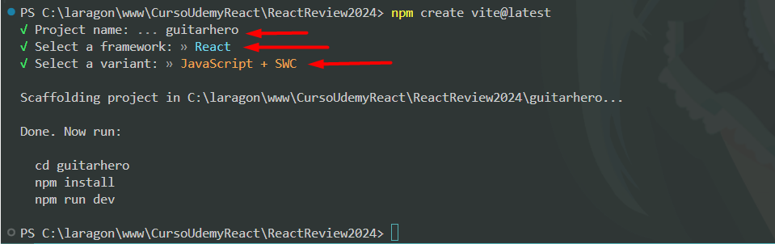

# React + Vite

# Primer Proyecto React GuitarHero

## Podemos iniciar el proyecto con vite 
- Paso 0: Debemos tener instaldo node.js v20.11, npm v10.5.1
- Paso 1: npm create vite@latest
    - Paso 1.1: Seguimos los pasos  
